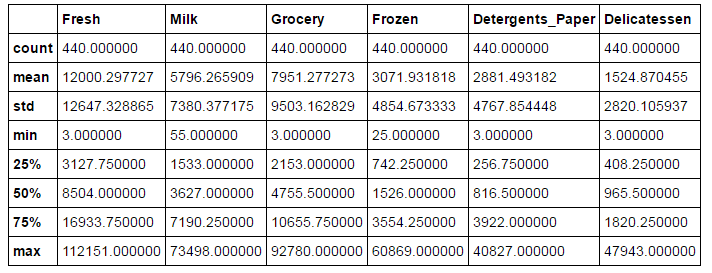
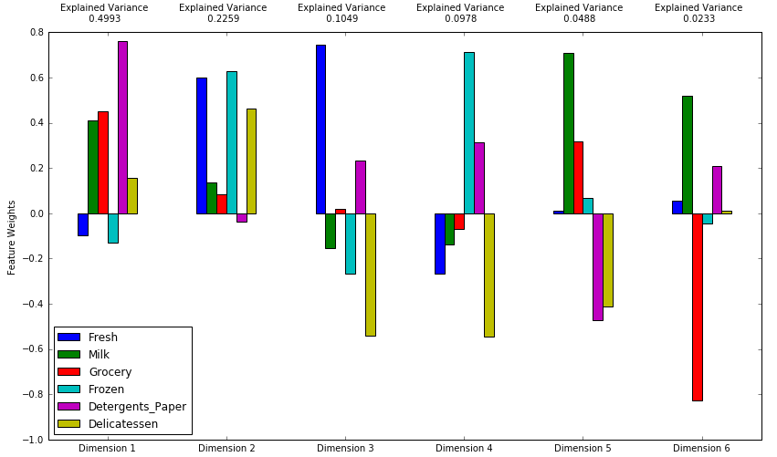
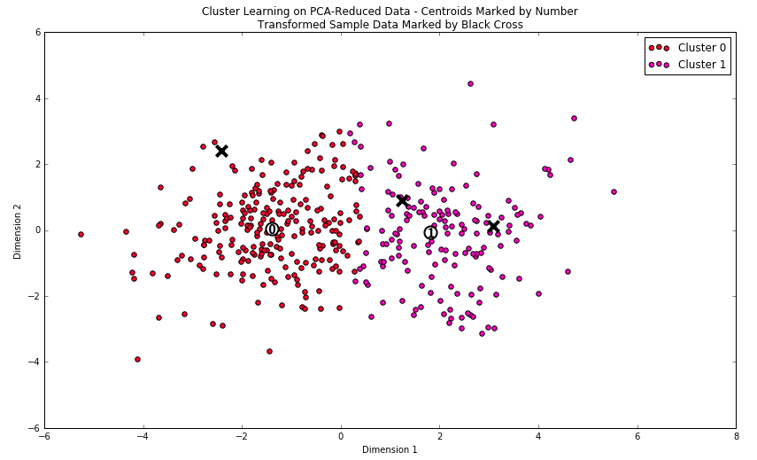

# Customer_Segments
This repository contains project files for ‘Project 2 - Customer Segments’ as part of Udacity's Machine Learning Nanodegree. The project can be viewed by opening 'customer_segments.html' in a web browser, or can be run interactively by opening 'customer_segments.ipynb' in a Jupyter Notebook.

I start this project by providing a basis statistical analysis of a dataset containing data on various customers' annual spending amounts of diverse product categories. The main goal of this project is to then describe the variation in the different types of customers that a wholesale distributor may interact with. The information gained in this process could help the distributor improve the structure of their delivery service and better meet the needs of each customer.

Starter files provided by Udacity are in the 'Customer Segments Starter Files' folder. 

## Screenshots
Below are a few screenshots showing features of this project.

## Installation
The installation documentation for the Jupyter platform can be found [here](https://jupyter.readthedocs.io/en/latest/install.html).
The documentation for advanced usage of Jupyter notebook can be found
[here](https://jupyter-notebook.readthedocs.io/en/latest/).

This project requires **Python 2.7** and the following Python libraries installed:

- [NumPy](http://www.numpy.org/)
- [Pandas](http://pandas.pydata.org)
- [matplotlib](http://matplotlib.org/)
- [scikit-learn](http://scikit-learn.org/stable/)

## Usage - Running Jupyter notebook

### Running in a local installation

Launch with:

    $ jupyter notebook
